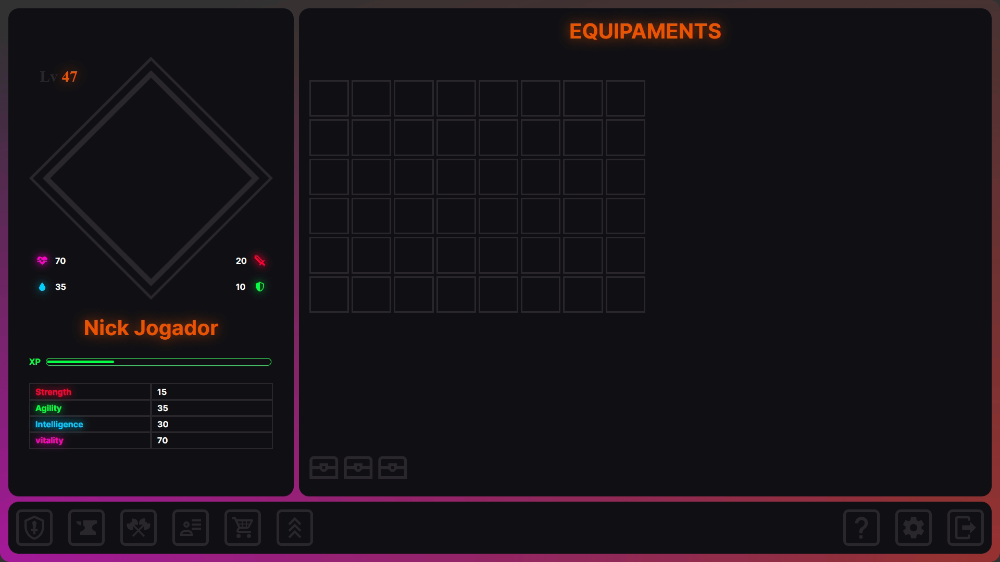

# Multilanguage README Choose your language

 

<h1 align="center">
  💻 IdlePvP (Under Construction)
</h1>

<h4 align="center"><a href="https://idle-pvp.vercel.app/">Click to visit the project</a></h4>

## 📚 Sections

The game has nine tabs:

-   **Equipment:** Backpack and equipment to equip on the character;
-   **Construction:** Crafting weapons and armor;
-   **Arena:** Where players gather for battles;
-   **Information:** Displays detailed information about your character;
-   **Shop:** Purchase customizations and weapons;
-   **Leaderboard:** Shows players' positions on a global leaderboard;
-   **Help:** Provides information on how the game works and general information;
-   **Settings:** Audio, video, and information display settings;
-   **LogOut:** Log out of the account.

---

## 💼 Technologies Used

The following technologies have been used for the development of this game so far:

-   HTML;
-   Sass;

---

<h2>🦄 Author</h2>

<table>
  <tr>
    <td align="center">
      <a href="https://github.com/PasqualiRafael">
         
        
          <b>Pasquali</b>
        
      </a>
    </td>
  </tr>
</table>
