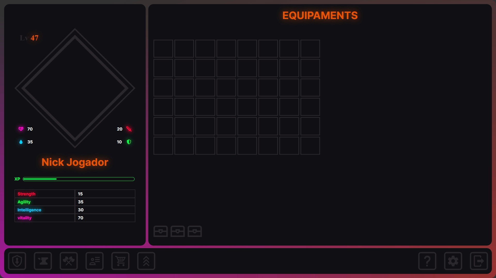

# Multilanguage README Choose your language

 

<h1 align="center">
  💻 IdlePvP (Em Construção)
</h1>

<h4 align="center"><a href="https://idle-pvp.vercel.app/">Clique para visitar o projeto</a></h4>

## 📚 Seções

O Jogo possui nove abas:

-   **Equipamentos:** Mochila e Equipamentos para colocar no personagem;
-   **Construção:** Criação de armas e armaduras;
-   **Arena:** Local aonde jogadores se encontram para as batalhas;
-   **Informações:** Exibe informações detalhadas sobre seu personagem;
-   **Loja:** Compra de personalizaveis e armas;
-   **Placar:** Mostrar a posição dos jogadores em um placar mundial;
-   **Ajuda:** Possui informações de como funciona o jogo, e informações gerais;
-   **Configurações:** Configurações de audio, video e como as informações apareceram.;
-   **LogOut:** Sair da conta.;

---

## 💼 Tecnologias utilizadas

Para o desenvolvimento deste jogo foi utilizado as seguintes tecnologias até o momento:

-   HTML;
-   Sass;

---

<h2>🦄 Autor</h2>

<table>
  <tr>
    <td align="center">
      <a href="https://github.com/PasqualiRafael">
         
        
          <b>Pasquali</b>
        
      </a>
    </td>
  </tr>
</table>
